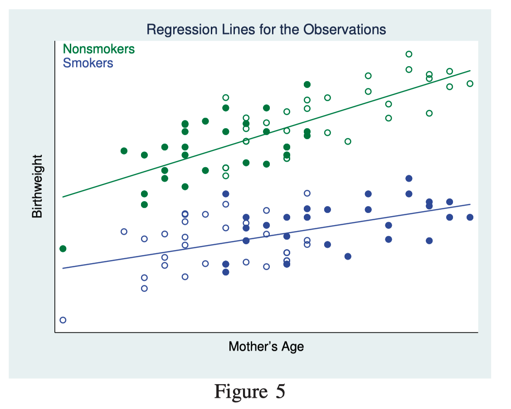
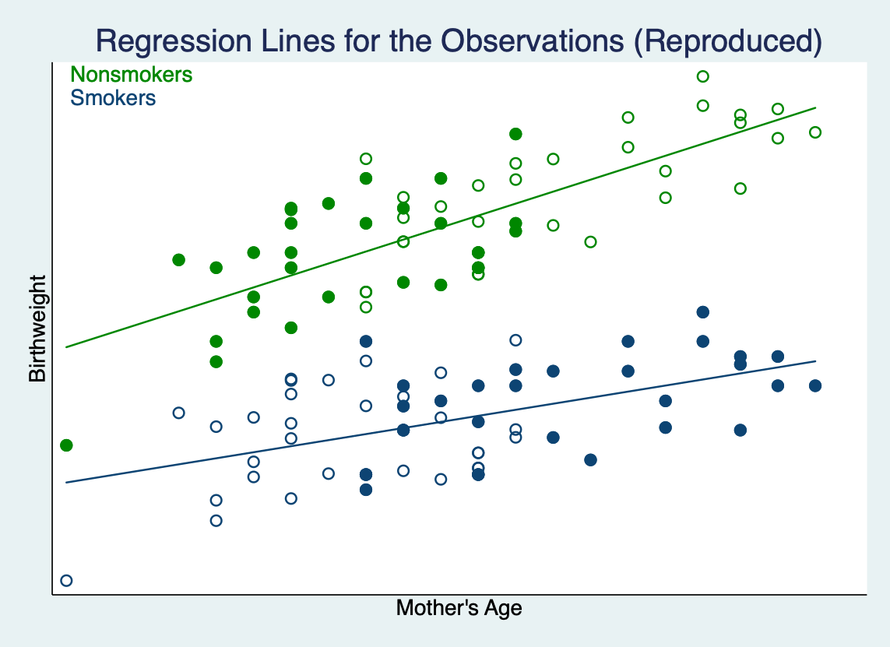
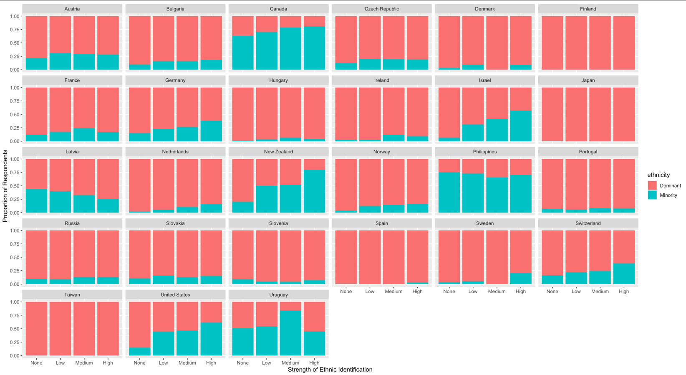
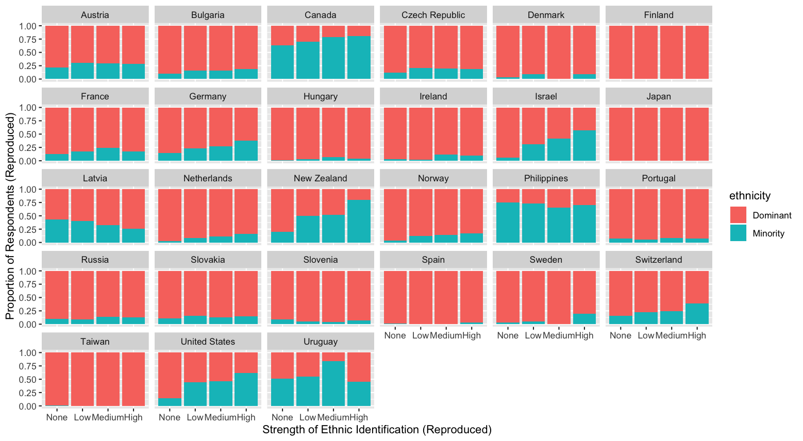
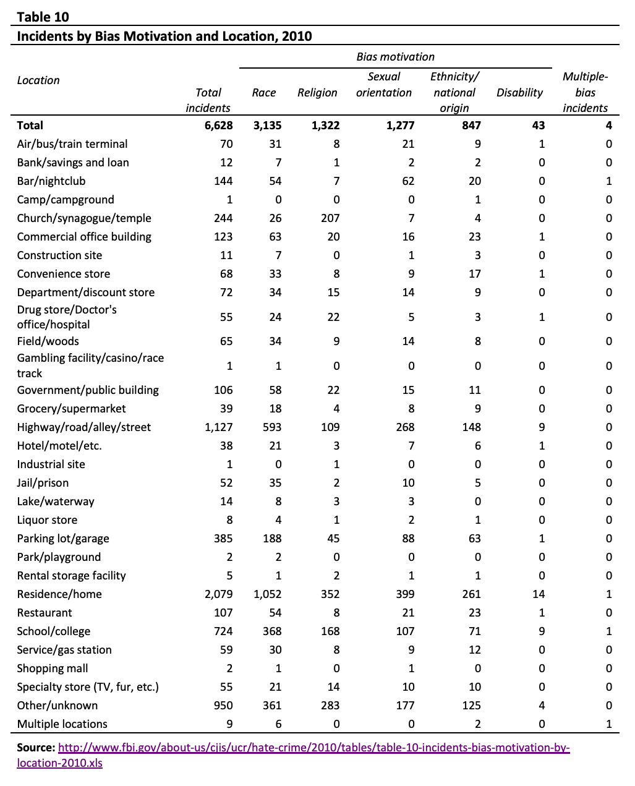
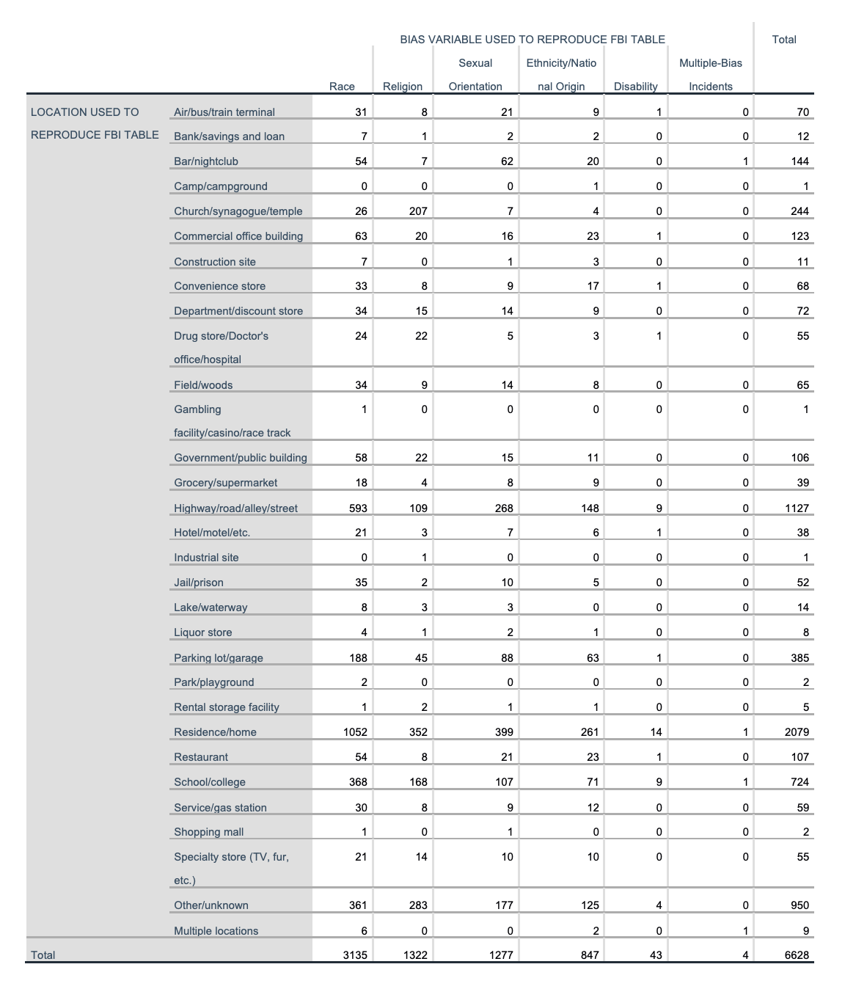

- [Stata](#stata)
- [R](#r)
- [SPSS](#spss)

## Stata

Goal:  replicate the analysis described on pages 194-196 of the Stata Treatment Effect Manual on the effect of mother’s smoking behavior on infant birth weight

Plot to reproduce & reproduction:

---

---

## R

Goal: reproduce the provided plot

Plot to reproduce (credited: Dr. Brandon Gorman) & reproduction:

---

---

## SPSS

Goal: reproduce the number of hate crime incidents by bias motivation and location from Table 10 of the FBI’s Hate Crime Statistics webpage

Table to reproduce:

---
Reproduction:

